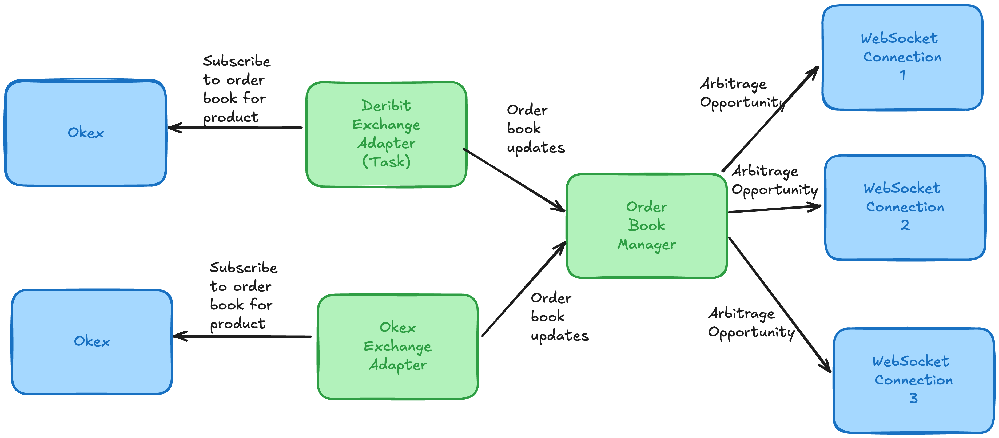

# arbitrage
A Rust CLI tool to identify option arbitrages between different exchanges

## Running the server

```bash
cargo run --bin server
```

This will start the following workers:

- OrderBookManager : This is responsible for checking for arbitrage opportunities and broadcasting them to the endpoint.
- Endpoint : This is responsible for accepting websocket connections and broadcasting arbitrage opportunities to the clients.
- DeribitExchangeAdapter : This is responsible for subscribing to deribit and fetching the order book data.
- OkexExchangeAdapter : This is responsible for subscribing to okex and fetching the order book data.

## Setting up the environment variables

The server has the following environment variables:

- `OKEX_WS_URL`: The URL of the Okex WebSocket API
- `OKEX_PRODUCTS_TO_SUBSCRIBE`: The products to subscribe to, separated by commas
- `OKEX_HEARTBEAT_MILLIS`: The heartbeat interval in milliseconds
- `DERIBIT_WS_URL`: The URL of the Deribit WebSocket API
- `DERIBIT_PRODUCTS_TO_SUBSCRIBE`: The products to subscribe to, separated by commas
- `DERIBIT_HEARTBEAT_MILLIS`: The heartbeat interval in milliseconds
- `WEBSOCKET_SERVER_PORT`: The port on which the server will listen for incoming websocket connections


By default, the server will use the environment variables in the `.env/server.env` file.
- `OKEX_WS_URL`: wss://ws.okx.com:8443/ws/v5/public
- `OKEX_PRODUCTS_TO_SUBSCRIBE`: BTC-USD-250221-90000-P
- `OKEX_HEARTBEAT_MILLIS`: 5000
- `DERIBIT_WS_URL`: wss://www.deribit.com/ws/api/v2
- `DERIBIT_PRODUCTS_TO_SUBSCRIBE`: book.BTC-21FEB25-90000-P.none.20.100ms
- `DERIBIT_HEARTBEAT_MILLIS`: 5000
- `WEBSOCKET_SERVER_PORT`: 9027


## How to subscribe to the websocket server

Using `websocat`
```bash
websocat ws://localhost:9027/stream/v1
```
You can also use tools like postman.

## Architecture Diagram


